This was my first time clearing all the OSINT challenges in a CTF competition. I'd like to share my journey here, and I'll keep striving for more all-clears in the future. Big thanks to the organizers — you made a good job!

---

## 🐦 Mr. Blue Sky Suite

### Challenge 1 — Mr. Blue Sky *(418 solves)*

:::note[Challenge Description]
Mr. Blue Sky is your average go-lucky BlueSky user, but is there something more to his profile? See if you can find anything on his profile.
:::

#### 💡 Solution

Following the link provided, we found Mr. Blue Sky's profile on the social networking platform called BlueSky. His bio indicated that he loves birds.
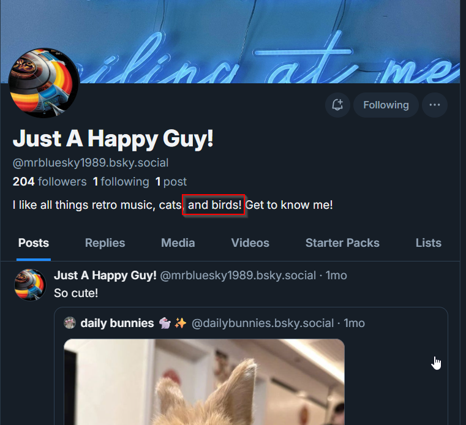
In the Starter Packs section, we discovered that he had created a list of people to introduce to his friends.
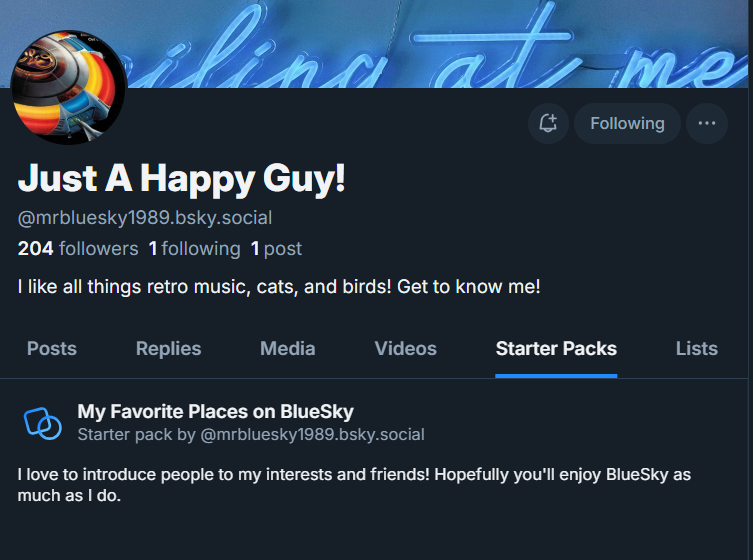
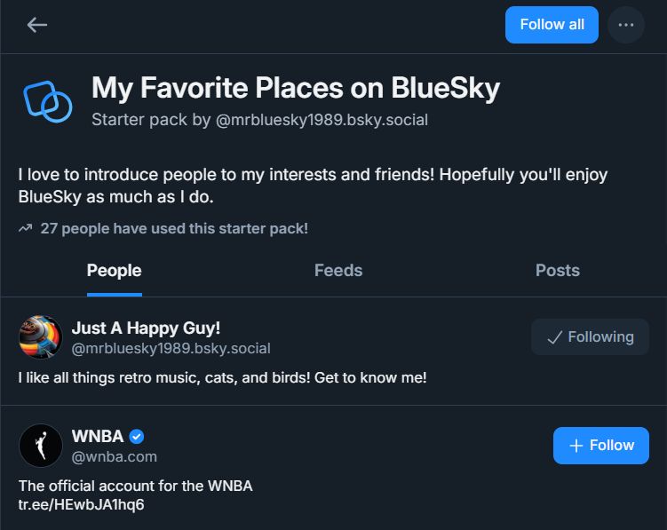
Scrolling down the list, we found an account named Mark the Bird Watcher whose bio contained the flag.
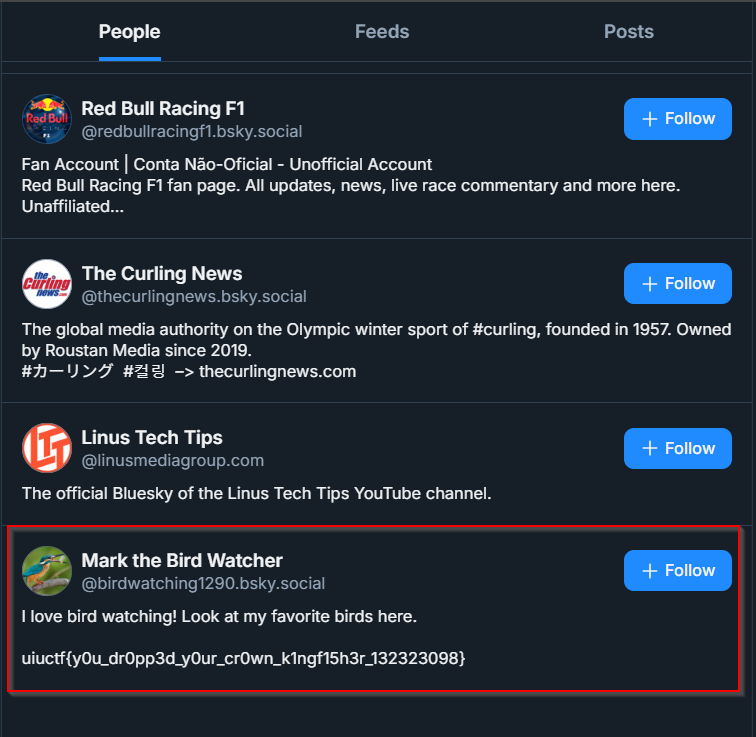

🚩 `uiuctf{y0u_dr0pp3d_y0ur_cr0wn_k1ngf15h3r_132323098}`

---

### Challenge 2 — Bad Blood *(170 solves)*

:::note[Challenge Description]
Mr. Blue Sky is just trying his best to build a following, but he's been trying to hide interactions from a particular troll!
:::

#### 💡 Solution

Initially, I spent hours searching for the troll among various users who posted fake flags. These trollers had left comments on Mr. Blue Sky's bunny post. When I followed their profiles, I found what appeared to be "flags," but they were completely fake.

Later, I examined the Starter pack and discovered that Mr. Blue Sky liked astrology feeds.
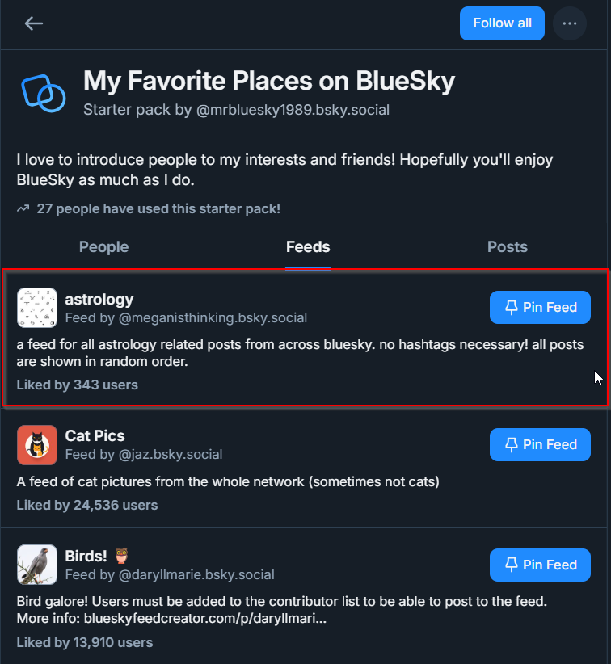
Additionally, I discovered another way to find the flag (though I'm not sure if this was the intended approach): I searched for the keyword "uiuctf" in Bluesky.

In the Feeds section, I found a feed containing the flag. When I submitted it, it was accepted as correct.
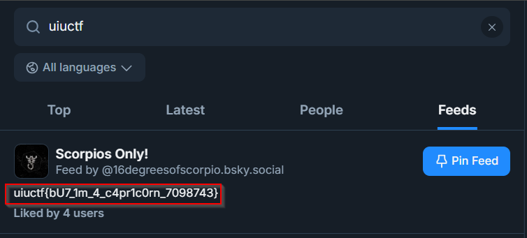

🚩 `uiuctf{bU7_1m_4_c4pr1c0rn_7098743}`

Note: To be honest I am still confused about it.

---

### Challenge 3 — Age of Aquarius *(54 solves)* ⭐

:::tip[Highlight]
First time solving a challenge with the fewest solves — 19th/20th solver!
:::

:::note[Challenge Description]
Now that we know about Mr. Blue Sky's troll, we can learn more about her. It looks like she's got a birthday party coming up, can you figure out in which country?
:::

#### 💡 Solution

In the profile of the troll, we saw Tumblr links.

Clicking on any of these links revealed her Tumblr blogs with various posts.

Let's gather information about her.

She announced that her birthday party would be held near the place where she was born and raised.
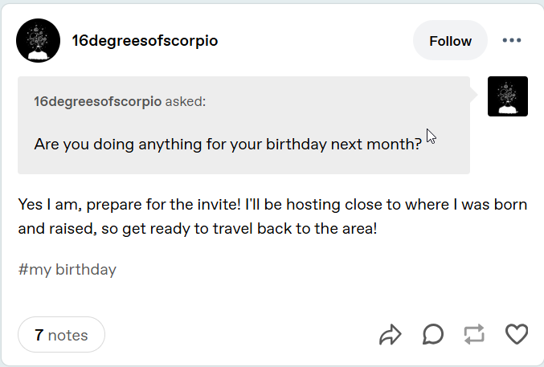
In the post below, she mentions a satellite's birthday that falls 3 days after her own birthday. According to her post, this satellite's birthday was one week before the time she posted this.
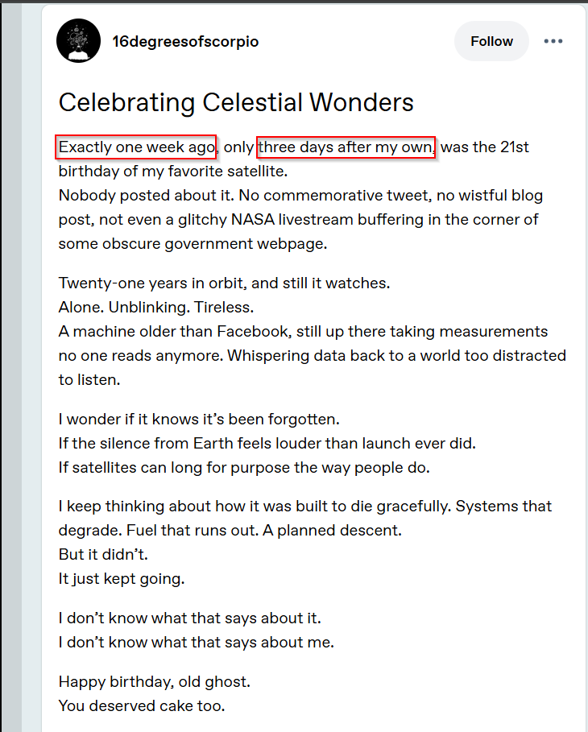
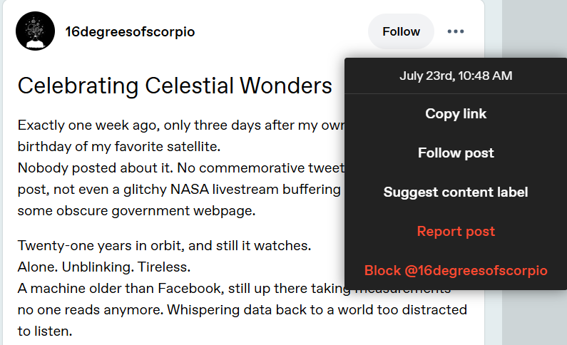
The post was dated July 23rd, so the satellite's birthday was July 16th. Her birthday was July 13th (Point 1).

Following this post, she also shared her astro chart (Point 2).
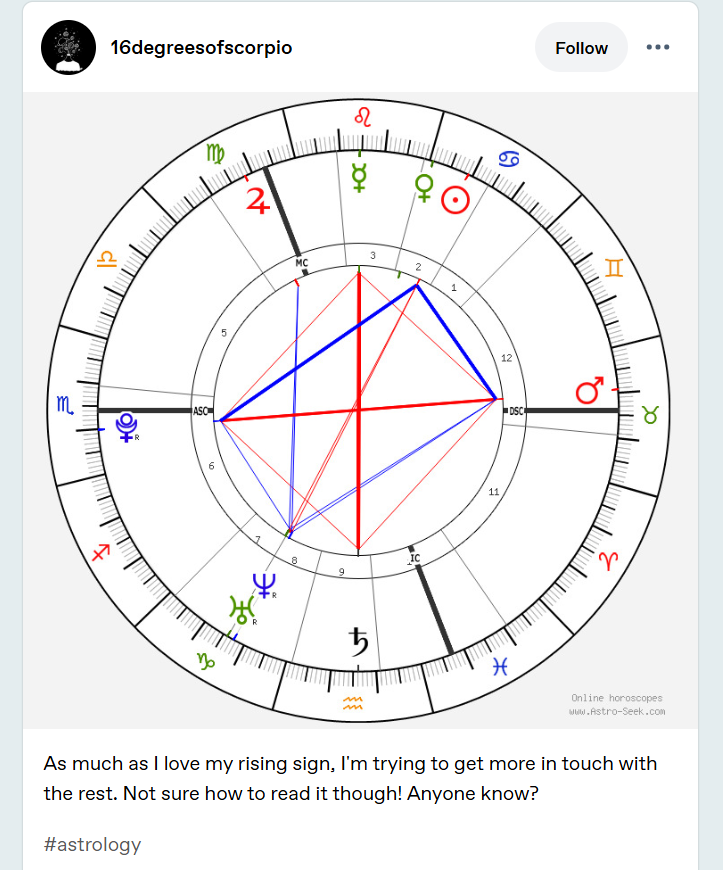
It's worth noting that an astro chart can be used to determine a person's birthday and birth location (though not with perfect precision, but with relative accuracy)

Using points 1 and 2, I found a helpful website with a chart reverse engineering tool: https://horoscopes.astro-seek.com/reverse-engineering-chart-astrology-online-calculator The chart was also generated by this website.

Since I have limited ability to interpret the degrees, minutes, and seconds, I examined the chart to identify the corresponding symbols and entered their details as shown below. Click "Find Date and Place" to generate the chart with the corresponding index.
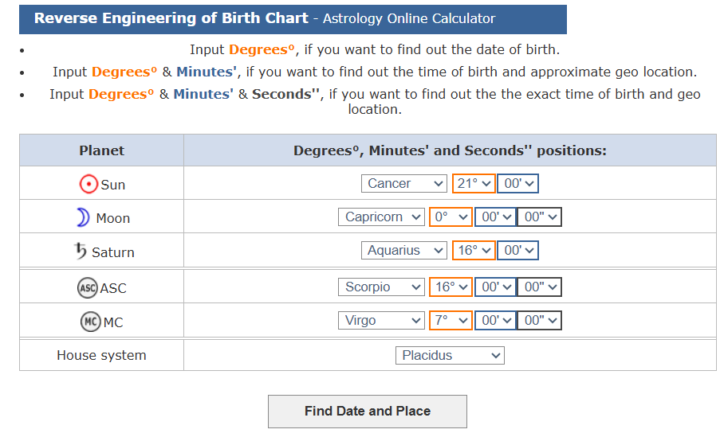
I should note that the chart only displays the positions of the sun, Saturn, ASC, and MC. The moon position wasn't visible (or I may have missed it), so I had to test different possibilities.

After trying various signs, I found that placing the Moon in Capricorn generated a chart that closely matched the original.
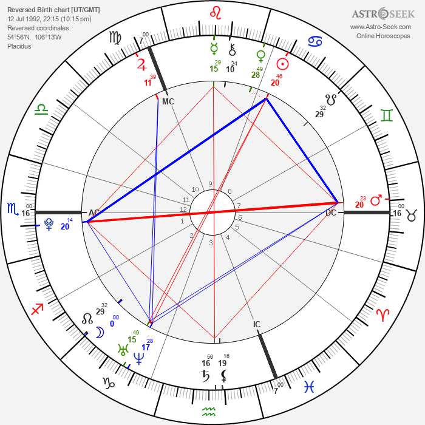
The tool provided the approximate coordinates: 54°56’35’’N, 106°13’44’’W, along with a direct link to view them on a map.
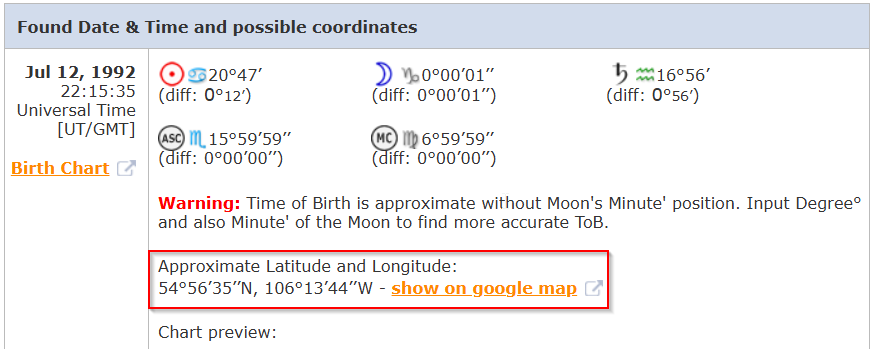
The birth place may be in Saskatchewan, Canada.
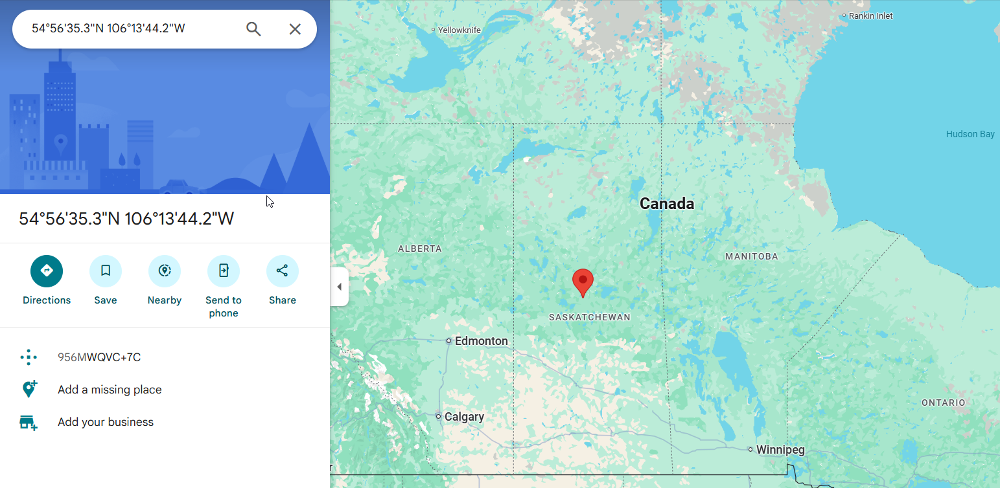

🚩 `uiuctf{Canada, Saskatchewan}`

Note: After completing this challenge, I unlocked a new skill: Birth Chart Reverse Engineering. I’m especially proud of this solve, as it’s the first time I’ve managed to crack a challenge with the fewest solves (I am the 19th or 20th solver!!).

---

## 🗺️ GeoGuesser Suite

### Challenge 4 — park *(437 solves)*

:::note[Challenge Description]
This picture was taken in a park. Find the name of the park.
The flag is the park’s name it appears on Google Maps. For example, if you think the flag is in Central Park, submit uiuctf{Central Park}.
:::
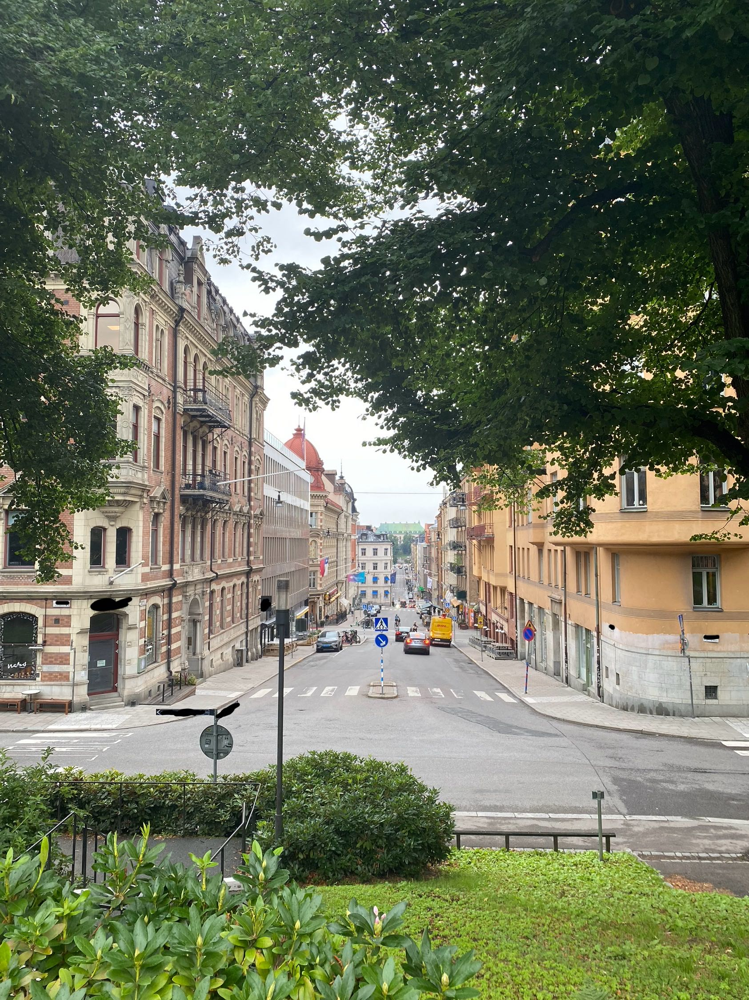

#### 💡 Solution

By performing a reverse image search on Google, we found that the building on the left side of the picture is located on Tegnérgatan, Stockholm, Sweden.
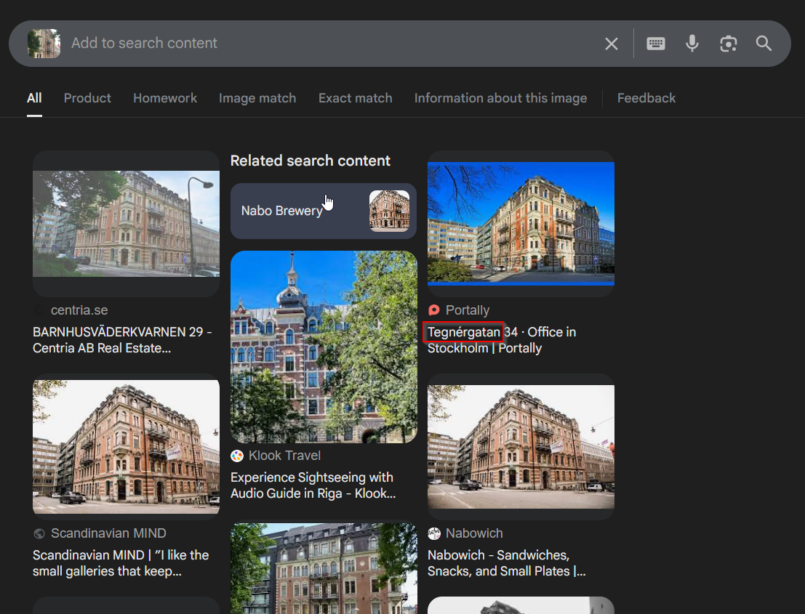
By searching the location on Google Maps and comparing it with the picture, we can easily identify the nearby park as Tegnérlunden Park. The red circle would be the person’s standing position while taking the photo.
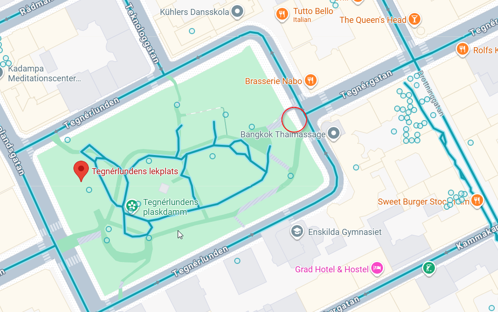
From Google Street View, we can confirm that the scene matches the picture.
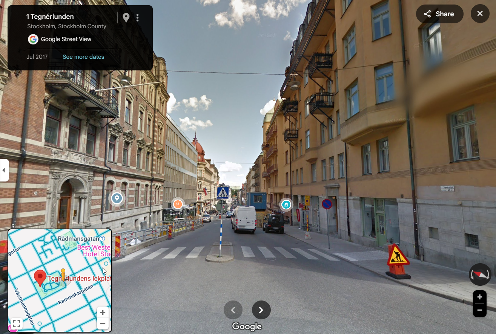

🚩 `uiuctf{Tegnérlunden}`

---

### Challenge 5 — cherry_blossom *(166 solves)*

:::note[Challenge Description]
I love cherry blossoms! But why is this one growing indoors?
This picture was taken inside a building. The flag is the address of the building as it appears on Google Maps. For example, if you think this photo was taken in Tokyo Tower, submit. uiuctf{4 Chome-2-8 Shibakoen, Minato City, Tokyo 105-0011, Japan}. If there are multiple addresses listed, use the Romanized version of the address.
:::

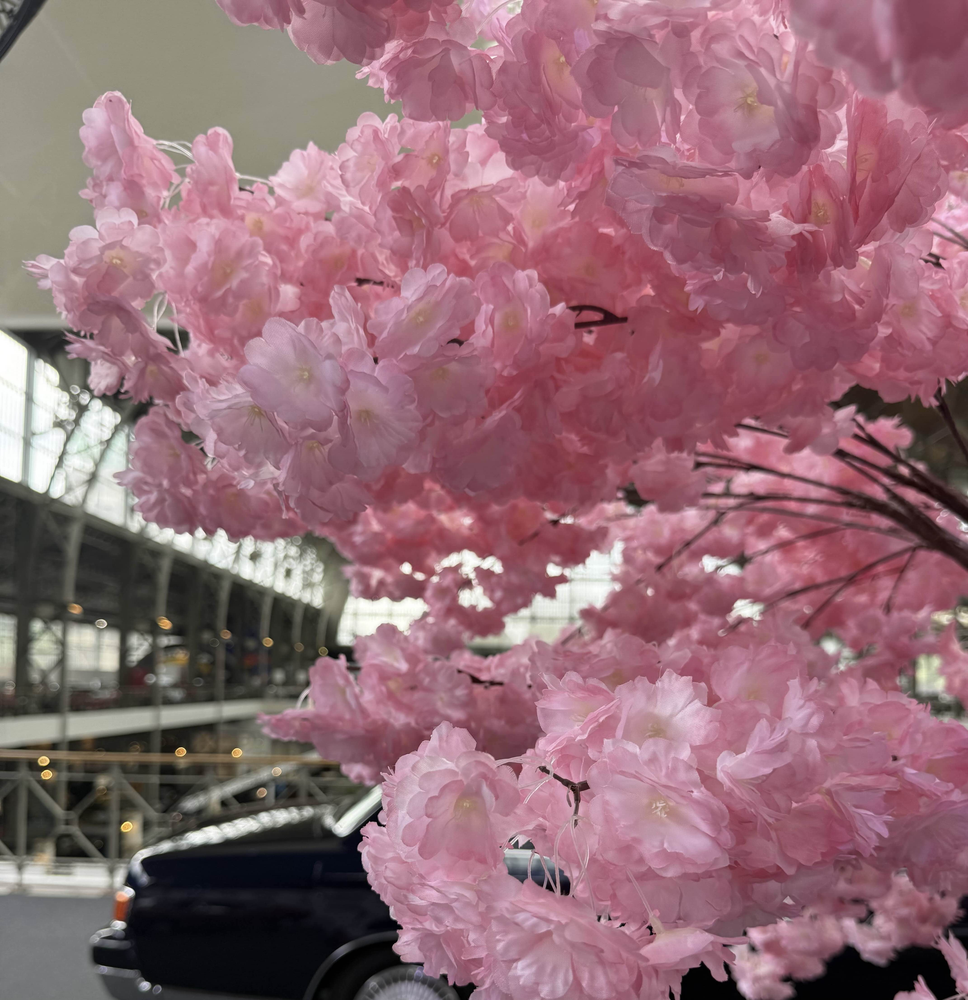

:::tip[Key Insight]
Reverse image search didn't work — used AI to enhance the blurred background, then searched again.
:::

#### 💡 Solution

At first, I felt like giving up on this challenge. A reverse image search didn’t work - the cherry blossom area was too broad, and the background buildings were far too blurry to identify. I spent hours trying different crops: focusing on the flowers, the cars (thinking maybe I could track down a showroom), and even the vague building structures in the back. But nothing matched.

After a long nap, I came up with a new idea: use AI to enhance the blurred background. I gave it a try, and it worked - the picture became clear enough to identify. Huge thanks to AI for the save!

After enhancing the image, I ran another reverse search on Google, which identified the location as Autoworld in Brussels. The building structure perfectly matches the one in the picture.

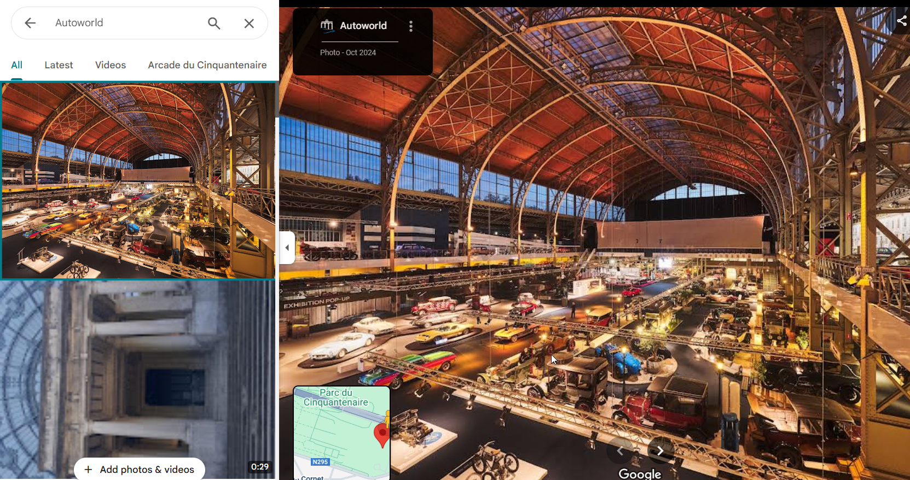
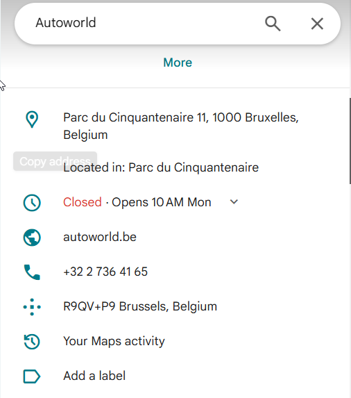

🚩 `uiuctf{Parc du Cinquantenaire 11, 1000 Bruxelles, Belgium}`
